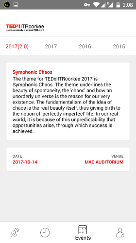

# TEDx - IITR

## About 
TEDxIITRoorkee is organized by a group of enthusiasts who form a part of the Entrepreneurship Development Cell. In 2017, [Mobile Development Group](https://mdg.sdslabs.co) built a mobile app for TEDx to help the attendees keep a track of its speakers, topics of ted talks, sponsors and organising committee. The app was built on `react-native` which is a modern framework for developing cross platform mobile apps. Read more about `react-native` [here](https://facebook.github.io/react-native/).

<a href='https://play.google.com/store/apps/details?id=com.tedxiitr&hl=en'>

</a>

<b>OR</b>

 

Follow the instructions below to succesfully run the app on your phone.

* Clone the repository by running the command `git clone https://github.com/sdsmdg/TEDx-ReactNative.git`.
* Go to the project repository.
* To run your app on the iOS Simulator or an Android Virtual Device, make sure that you have already installed Xcode (for ios) or have your Android development environment (for android) set up. 
* To setup the same, follow the instructions [here](https://facebook.github.io/react-native/docs/getting-started.html#content).
* Run `npm install` within the project directory to install the required node dependencies.
* You can run the command `adb devices` to check whether any emulators or physical devices are connected.
* You can now launch your app on a connected Android Virtual Device or a physical device by running `npm run android`, or on the iOS Simulator/physical device by running `npm run ios` (macOS only).

## Screenshots  
    
